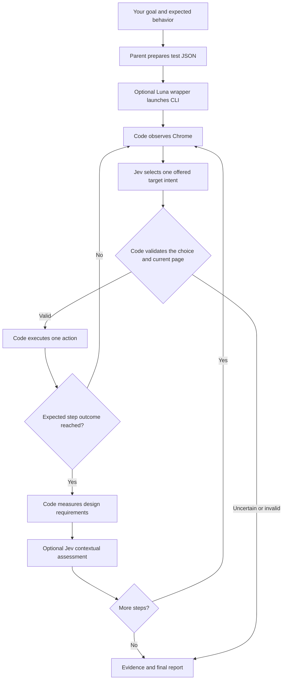

# How Jev QA works

This is a Python browser program with Jev inside its decision loop. The skill gives the
parent agent instructions for preparing a test and launching that program. An optional
Luna subagent launches one command and reports the saved result.

## The division of work

| Component | What it does |
|---|---|
| Parent agent | Turns your acceptance requirements into a test contract. Chooses selectors from the actual application. |
| Luna wrapper | Launches one bounded CLI command and summarizes its evidence. It does not decide clicks or substitute QA judgments. |
| Python runner | Opens a browser connection, sequences checkpoints, maintains progress, enforces limits, and saves evidence. |
| Browser observation code | Reads rendered HTML controls, labels, values, positions, and text. It creates the choices offered to Jev. |
| Jev | Selects from those choices and returns confidence and probabilities. It can also judge supplied text against explicit criteria. |
| Browser executor | Validates the selected reference, rechecks the page, and performs the action. |
| Assertions and design rules | Check expected values and states; measure clipping, contrast, alignment, disabled controls, and obstruction. |

Jev does not generate selectors, JavaScript, mouse coordinates, the test plan, or the report
prose. It does not receive screenshots. Screenshots are retained for independent inspection.
Known text values come from the test JSON. A missing value stops the Jev-only workflow.

Jev makes one target choice across visible controls, observed offscreen controls, and
WAIT/DONE/ABSTAIN. Each target carries its observed state and intended interaction.
This avoids a separate operation choice competing with a reveal choice. Code still
requires confidence of at least 0.80 by default and rechecks the target before acting.
For verified journeys, Jev also receives current assertion results. Entered values do not
prove that a form was submitted or that the next checkpoint was reached.

## A concrete example

Suppose the task says: filter for a workshop, open its details, choose two seats, and verify
the review screen.

1. Code reads the filter controls and their current values.
2. Jev selects the relevant field or dropdown option.
3. Code enters the supplied value and verifies it actually changed.
4. Jev selects the filter button. Code clicks it and verifies the expected result appears.
5. If the details button is offscreen, Jev can choose a `REVEAL` action for that observed control.
6. Code scrolls toward the control and observes again. Revealing it does not activate it.
7. Jev selects the now-visible button. Code checks that it is still the same control and is not covered.
8. After each verified checkpoint, code continues with the next objective and retained action history.
9. At the review screen, code checks the selected seat count and measures the declared design requirements.
10. The report separates execution progress, observed defects, uncertain judgments, and checks that were never reached.

The exact click sequence is chosen during the run. The expected behavior is supplied before
the run. This supports repeatable acceptance testing; it does not automatically discover
every requirement or every possible defect.

## How browser access works

The runner uses Chrome's debugging protocol through Browser Harness. It is not a Playwright
script and does not require a Playwright-created browser.

The default mode starts a disposable Chrome profile and closes that browser after the test.
The optional existing-Chrome mode connects to your running Chrome and opens its own temporary
test tab. That tab can reuse the connected profile's cookies and local storage. Cookies are
not exported or copied into a new profile.

A new tab does not inherit another tab's unsaved form values or tab-specific session storage.
The existing-Chrome option therefore means session/profile reuse, not taking control of an
arbitrary existing tab. The connected Chrome profile must already be signed into the target.

Chrome remote debugging must be enabled. Chrome can require you to allow the connection.
The runner does not change that permission, restart your browser, or close your existing tabs.
Relevant page text and observed controls are sent to TypeSafe for decisions. Restrict the
test contract to the intended application and authorized actions.

The runner records the IDs of its own tabs. An independent Chrome connection closes
those IDs even if Browser Harness crashes. It never infers ownership from newly appearing
tabs. If Chrome becomes unreachable, or the daemon fails before reporting its tab ID,
the report marks cleanup incomplete. The runner cannot guarantee cleanup in those cases.

## What the result means

An executed check can establish a product defect. A blocked action means the runner could
not establish the required outcome. An unreached check means there is no result for it.
These are different conditions and must not be combined into a false pass or a false defect.

Confidence is a decision threshold, not measured accuracy for your application. A Jev
`DONE` response cannot override failed assertions. Unsupported artwork and aesthetic
judgments remain uncertain.

## Where the code lives

- [CLI](jev_qa/__main__.py): loads the task, credentials, browser mode, and execution deadline.
- [Browser connection](jev_qa/browser.py): owns the connection and cleans up only the resources it owns.
- [Journey](jev_qa/journey.py): sequences verified checkpoints and aggregates results.
- [Runner](jev_qa/runner.py): observation, Jev calls, validation, execution, and evidence.
- [Design checks](jev_qa/design.py): classifies measured facts and calls Jev for explicit contextual criteria.
- [Browser measurements](jev_qa/measure.js): reads geometry, styles, and hit-test results.

See [README.md](README.md) for commands and the test JSON format.
